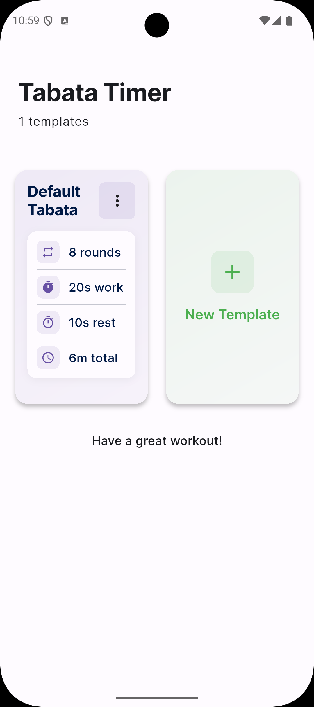
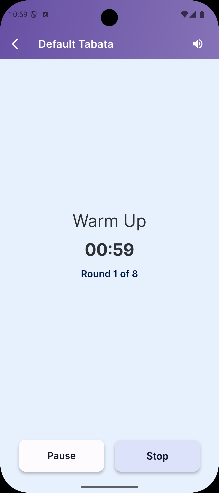

# Tabata Timer

A simple and effective Tabata timer application.

## Features

- Customizable work and rest intervals
- Adjustable number of rounds
- Clean and intuitive interface
- Sound notifications

## Screenshots

  
   

## Getting Started

1. Clone the repository
2. Install dependencies
3. Run the application

## License

This project is licensed under the MIT License - see the [LICENSE](LICENSE) file for details.
